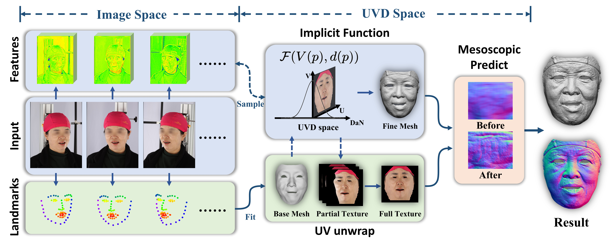

# Detailed Facial Geometry Recovery from Multi-View Images by Learning an Implicit Function

## About
In this paper, we propose a novel architecture to recover extremely detailed 3D faces in roughly 10 seconds. Unlike previous learning-based methods that regularize the cost volume via 3D CNN, we propose to learn an implicit function for regressing the matching cost. By fitting a 3D morphable model from multi-view images, the features of multiple images are extracted and aggregated in the mesh-attached UV space, which makes the implicit function more effective in recovering detailed facial shape.


### Our Pipeline

Our pipeline consists of three parts: base mesh ftting (green blocks), implicit function learning (blue blocks), and
mesoscopic recovery (pink block).

### Citation
```
@InProceedings{xiao2022detailed,
author = {Xiao, Yunze and Zhu, Hao and Yang, Haotian and Diao, Zhengyu and Lu, Xiangju and Cao, Xun},
title = {Detailed Facial Geometry Recovery from Multi-View Images by Learning an Implicit Function},
booktitle = {Proceedings of the AAAI Conference on Artificial Intelligence},
year = {2022}
}
```
## How to use

### Installation

We recommend to use `Python 3.6` for the following instruction
- `pip install -r requirements.txt`

Install `psbody-mesh` from [here](https://github.com/MPI-IS/mesh).

### Download

Before running the scripts, please download the predefined data from [here](https://box.nju.edu.cn/f/276275d42c7d48e3bc43/?dl=1). And unpack them to folder `./predfine_data/`  
Please download the meso model from [here](https://box.nju.edu.cn/f/11c90860dfc3418393db/?dl=1). And put it into folder `./dpmap_pred/checkpoints/`
- For demo, you can download a small set of data from [here](https://box.nju.edu.cn/f/624002278ff74b92a730/?dl=1)
- The entire FaceScape dataset mentioned in paper is coming soon.

And unpack the data to the `DATA_FOLDER`.

### Evaling 

Our method consists of several parts in the following order.
- Base mesh fitting code is coming soon
- Run `python eval_if.py` for implicit function learning
  lower `num_sample` in `eval_if.py` for lower GPU memory occupation
- Run `python eval_reg.py` for post regularization  
- Run `python gen_tex.py` for blended texture
- Run `cd dpmap_pred && python dpmap_pred/main.py --input DATAFOLDER/pred/texture_relocated --output DATAFOLDER/pred/pred/dp_map` for mesoscopic prediction  

If you want to use dpmap to get mesh of mesoscopic prediction, set the folder in `dpmap_pred/scripts/dpmap2mesh.py` and run `python dpmap_pred/scripts/dpmap2mesh.py`. It may cost some time for generating.

You can modifiy the config file `options.py` or use args `--ARGS` in command like `python eval_if.py --d_size 201`  
Before running, you should set the `dataroot` related args(`fit_dataroot`, `if_dataroot`, `reg_dataroot`) as `DATA_FOLDER`  

Other evaling code will be released in a few days.

### Traning

Training code is coming soon!


